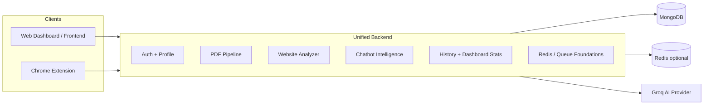

# PolicyGuard-AI

[](https://github.com/)
[](https://nodejs.org/)
[](https://vite.dev/)
[](https://developer.chrome.com/docs/extensions/)

PolicyGuard-AI is an evolving enterprise-grade AI privacy intelligence platform for reviewing privacy policies, terms and conditions, legal documents, PDFs, and website privacy surfaces. It combines a unified backend, AI-assisted risk scoring, browser extension detection, and a live dashboard experience into a single analysis workflow.

The platform is intentionally designed as a shared intelligence layer: the web dashboard, PDF analyzer, website analyzer, chatbot, and browser extension all route into the same backend services and MongoDB-backed analysis history.

## Project Status

| Area                    | Status                  | Current State                                                                                                             |
| ----------------------- | ----------------------- | ------------------------------------------------------------------------------------------------------------------------- |
| Unified backend         | Fully implemented       | One Express backend serves auth, analysis, history, cache, reports, chatbot, and extension APIs.                          |
| AI website analysis     | Fully implemented       | Website privacy pages can be scraped, cleaned, analyzed, and stored.                                                      |
| PDF analysis            | Fully implemented       | PDF upload, extraction, chunking, and risk analysis are wired end-to-end.                                                 |
| Enterprise dashboard    | Fully implemented       | Live stats, history views, and synchronized analysis results are present.                                                 |
| Browser extension       | Partially implemented   | Content detection, quick risk banner, and deep-analysis handoff are present.                                              |
| AI chatbot intelligence | Partially implemented   | Context-aware chat exists, with memory and analysis context support.                                                      |
| AI provider layer       | Partially implemented   | Groq is the active provider path; Gemini/OpenAI adapter files are scaffolded and should not be treated as fully deployed. |
| Production foundations  | Implemented foundations | JWT auth, rate limiting, sanitization, security headers, request IDs, and health checks are in place.                     |
| Redis / queue support   | Foundation only         | Redis-backed cache and BullMQ queue support are configurable and disabled by default.                                     |

## Key Features

### AI Website Analyzer

- Privacy policy analysis for public website pages.
- Clause detection and structured risk extraction.
- AI risk scoring across low, medium, high, and critical levels.
- Trust intelligence summaries for legal and privacy review.
- Website legal analysis through a centralized backend pipeline.

### PDF Analyzer

- Secure PDF upload and validation.
- Text extraction, chunking, and prompt preparation.
- AI clause understanding for legal and privacy language.
- Risk extraction and analysis persistence to MongoDB.

### Browser Extension

- Detects privacy-related pages while browsing.
- Surfaces a quick risk banner for lightweight triage.
- Provides a Deep Analysis handoff into the dashboard.
- Uses the centralized backend instead of a separate extension-only intelligence stack.

### Enterprise Dashboard

- Analytics cards and charts for scans and risk posture.
- Analysis history with delete and detail flows.
- Live synchronization across uploaded PDFs, website scans, and deletion events.

### AI Chatbot

- Context-aware assistant for privacy and legal questions.
- Understands both PDF and website analysis context.
- Explains clauses, risks, and analysis outputs.
- Uses session memory and recent analysis context when available.

### Production Foundations

- JWT authentication and protected API routes.
- Rate limiting for auth, analysis, chatbot, and general traffic.
- Redis-ready cache layer with in-memory fallback.
- Queue-ready architecture for future background analysis workers.
- Structured logging, security headers, payload limits, and request sanitization.

## Architecture Overview

PolicyGuard-AI uses a single backend as the source of truth for analysis, auth, history, and chatbot intelligence.



### Architectural Principles

- One backend for all product surfaces.
- Shared APIs across dashboard, extension, and analysis flows.
- Shared MongoDB analysis history and user records.
- Shared AI analysis engine and prompt pipeline.
- Shared chatbot intelligence that can reference prior analysis context.
- Browser extension as a thin client that quickly detects, then redirects into deep analysis.

## Tech Stack

| Layer                  | Technologies                                                     |
| ---------------------- | ---------------------------------------------------------------- |
| Backend runtime        | Node.js, Express, CommonJS modules                               |
| Backend security       | JWT, Helmet, CORS allowlist, rate limiting, request sanitization |
| Backend data           | MongoDB, Mongoose                                                |
| Backend performance    | Compression, caching layer, optional Redis, optional BullMQ      |
| AI layer               | Groq integration, provider abstraction for future adapters       |
| Frontend               | React 18, Vite, React Router, Axios, Recharts, Framer Motion     |
| Extension              | Chrome Extension Manifest V3, content scripts, popup UI          |
| Styling                | Tailwind CSS                                                     |
| Charts and UI feedback | Recharts, motion-based interactions, alert and risk components   |

## Screenshots

Replace these placeholders with real product captures before publishing externally.

| View                   | Placeholder                             |
| ---------------------- | --------------------------------------- |
| Dashboard              | `docs/screenshots/dashboard.png`        |
| PDF Analyzer           | `docs/screenshots/pdf-analyzer.png`     |
| Website Analyzer       | `docs/screenshots/website-analyzer.png` |
| Chrome Extension Popup | `docs/screenshots/extension-popup.png`  |
| Chatbot                | `docs/screenshots/chatbot.png`          |

## Folder Structure

```text
PolicyGuard-AI/
├── backend/
│   ├── src/
│   │   ├── ai/
│   │   ├── chatbot/
│   │   ├── config/
│   │   ├── constants/
│   │   ├── controllers/
│   │   ├── middleware/
│   │   ├── models/
│   │   ├── pdf/
│   │   ├── prompts/
│   │   ├── routes/
│   │   ├── scraper/
│   │   ├── services/
│   │   └── utils/
│   ├── test/
│   ├── package.json
│   └── README.md
├── frontend/
│   ├── src/
│   │   ├── components/
│   │   ├── context/
│   │   ├── layouts/
│   │   ├── pages/
│   │   ├── routes/
│   │   ├── services/
│   │   └── utils/
│   ├── public/
│   └── package.json
├── extension/
│   ├── public/
│   ├── src/
│   └── package.json
└── README.md
```

## Installation

### Prerequisites

- Node.js 18+ recommended.
- MongoDB instance, local or hosted.
- Groq API key for the currently active AI path.
- Optional Redis instance if you want to enable cache persistence or queues.
- Google Chrome or a Chromium-based browser for the extension.

### Clone and install

```bash
git clone <your-repo-url>
cd PolicyGuard-AI
```

## Environment Variables

### Backend (`backend/.env`)

| Variable                      | Required          | Purpose                                                           |
| ----------------------------- | ----------------- | ----------------------------------------------------------------- |
| `MONGO_URI`                   | Yes               | MongoDB connection string.                                        |
| `JWT_SECRET`                  | Yes in production | JWT signing secret.                                               |
| `JWT_EXPIRY`                  | No                | Token lifetime, default `7d`.                                     |
| `FRONTEND_URL`                | No                | Allowed web app origin, default `http://localhost:5173`.          |
| `CORS_ALLOWED_ORIGINS`        | No                | Additional comma-separated origins.                               |
| `AI_PROVIDER`                 | No                | `groq` is the working path; other adapters are scaffolded.        |
| `GROQ_API_KEY`                | Yes for Groq      | Groq API key.                                                     |
| `GROQ_MODEL`                  | No                | Groq model name.                                                  |
| `REDIS_ENABLED`               | No                | Enables Redis-backed cache when `true` or `1`.                    |
| `REDIS_URL`                   | No                | Redis connection string, default `redis://127.0.0.1:6379`.        |
| `QUEUE_ENABLED`               | No                | Enables BullMQ workers when `true` or `1`.                        |
| `QUEUE_PREFIX`                | No                | Queue namespace prefix.                                           |
| `RATE_LIMIT_*`                | No                | Auth, analysis, chatbot, and general request limits.              |
| `MAX_REQUEST_SIZE`            | No                | Payload limit, default `5mb`.                                     |
| `REQUEST_TIMEOUT_MS`          | No                | Default request timeout.                                          |
| `ANALYSIS_REQUEST_TIMEOUT_MS` | No                | Longer timeout for analysis jobs.                                 |
| `EXTENSION_ALLOWED_IDS`       | No                | Comma-separated extension IDs allowed to access extension routes. |

### Frontend (`frontend/.env`)

| Variable       | Required | Purpose                                            |
| -------------- | -------- | -------------------------------------------------- |
| `VITE_API_URL` | No       | Backend base URL, default `http://localhost:3000`. |

### Extension

The extension is built to call the centralized backend and does not require a separate runtime `.env` file for standard local use. If you change backend origin or hosting, update the extension build or configuration accordingly.

## Backend Setup

```bash
cd backend
npm install
```

Create `backend/.env` with at least the required backend values above, then start the server:

```bash
npm start
```

Backend health endpoints:

- `GET /` returns a simple API status response.
- `GET /health/db` reports MongoDB connectivity.
- `GET /health/cache` reports cache health.

## Frontend Setup

```bash
cd frontend
npm install
```

Create `frontend/.env` if you want to override the backend URL:

```env
VITE_API_URL=http://localhost:3000
```

Start the app:

```bash
npm run dev
```

## Extension Setup

```bash
cd extension
npm install
npm run build
```

The extension uses a Manifest V3 popup and content script. The browser-facing pieces are designed to stay lightweight and forward heavy work to the centralized backend.

## Chrome Extension Loading

1. Open `chrome://extensions`.
2. Enable Developer Mode.
3. Click Load unpacked.
4. Select the built extension output folder, typically `extension/dist` after running the build.
5. Visit a privacy policy or terms page to see the injected detection workflow.

## API Overview

### Health

| Method | Endpoint        | Purpose                     | Status      |
| ------ | --------------- | --------------------------- | ----------- |
| `GET`  | `/`             | Basic API running check.    | Implemented |
| `GET`  | `/health/db`    | MongoDB connectivity check. | Implemented |
| `GET`  | `/health/cache` | Cache health check.         | Implemented |

### Authentication and Profile

| Method | Endpoint                | Purpose                                   | Status      |
| ------ | ----------------------- | ----------------------------------------- | ----------- |
| `POST` | `/auth/register`        | Register a new user.                      | Implemented |
| `POST` | `/auth/login`           | Login and return JWT.                     | Implemented |
| `POST` | `/auth/logout`          | End the session.                          | Implemented |
| `GET`  | `/auth/profile`         | Fetch authenticated user profile.         | Implemented |
| `PUT`  | `/auth/profile`         | Update authenticated user profile.        | Implemented |
| `POST` | `/auth/change-password` | Update password.                          | Implemented |
| `GET`  | `/api/profile`          | Alternate authenticated profile snapshot. | Implemented |

### Analysis

| Method | Endpoint                      | Purpose                                            | Status                 |
| ------ | ----------------------------- | -------------------------------------------------- | ---------------------- |
| `POST` | `/pdf/upload`                 | Upload a PDF and run analysis.                     | Implemented            |
| `POST` | `/website/analyze`            | Analyze a website privacy page.                    | Implemented            |
| `POST` | `/analyze`                    | Legacy general analysis route.                     | Implemented            |
| `POST` | `/api/v1/analyze`             | Extension-aware analysis route with optional auth. | Implemented foundation |
| `GET`  | `/api/v1/analyze/jobs/:jobId` | Job status for queued analysis flows.              | Foundation             |

### History, Reports, and Cache

| Method   | Endpoint                   | Purpose                             | Status      |
| -------- | -------------------------- | ----------------------------------- | ----------- |
| `GET`    | `/history/dashboard-stats` | Dashboard metrics and risk summary. | Implemented |
| `GET`    | `/history`                 | History list.                       | Implemented |
| `GET`    | `/history/:id`             | Single analysis details.            | Implemented |
| `DELETE` | `/history/:id`             | Delete a history entry.             | Implemented |
| `GET`    | `/reports/:id/download`    | Download generated report.          | Implemented |
| `GET`    | `/cache/stats`             | Cache statistics.                   | Implemented |
| `POST`   | `/cache/clear`             | Clear cached entries.               | Implemented |
| `POST`   | `/cache/cleanup`           | Cleanup expired cache data.         | Implemented |

### Chat

| Method | Endpoint        | Purpose                         | Status             |
| ------ | --------------- | ------------------------------- | ------------------ |
| `POST` | `/chatbot/chat` | Protected contextual assistant. | Implemented        |
| `POST` | `/chat/chat`    | Legacy chat entry point.        | Compatibility path |

## AI Analysis Workflow

```text
User submits PDF or website URL
↓
Request is authenticated, sanitized, and rate limited
↓
Backend extracts text or scrapes the page
↓
Document is chunked and converted into analysis context
↓
Prompt builder adds risk rules and conversation context
↓
Groq returns structured risk intelligence
↓
Result is scored, normalized, and persisted in MongoDB
↓
Dashboard and history views refresh from the shared backend
```

### Notes on AI Providers

- Groq is the active provider path in the current implementation.
- Gemini and OpenAI adapter files exist in the backend, but they should be treated as scaffolded or future-facing rather than fully deployed production paths.
- The provider abstraction is intentionally isolated so additional engines can be added without rewriting the analysis flow.

## Dashboard Workflow

```text
Dashboard loads
↓
Fetches shared analytics from /history/dashboard-stats
↓
Charts and KPI cards render from the same backend source of truth
↓
Upload, website scan, or delete events trigger a refresh
↓
History, result pages, and dashboard stay synchronized
```

The dashboard currently uses a shared analytics context and refresh events to keep views aligned. That gives near-real-time UX inside the app, without claiming a full server-push WebSocket architecture.

## Chatbot Workflow

```text
User asks a privacy or legal question
↓
Intent is detected
↓
Relevant PDF / website context is assembled
↓
Conversation memory and recent turns are attached when available
↓
Prompt is sent through the active AI provider
↓
Assistant answers with clause-level or risk-aware explanation
```

The chatbot is designed to understand analysis context, not just free-form chat. It can explain why a clause matters, what risk level it maps to, and how the result relates to the underlying document or page.

## Security Features

- JWT-based authentication for protected routes.
- Helmet security headers.
- CORS allowlisting with support for the frontend and extension origins.
- Request logging with unique request IDs.
- Request sanitization for body, query, and params.
- Rate limiting by traffic class.
- Payload size limits and request timeouts.
- Extension authorization checks for extension-facing API routes.
- Health endpoints for operational visibility.

## Scalability Foundations

- Redis-ready cache adapter with a graceful in-memory fallback.
- BullMQ queue scaffolding behind environment flags.
- Modular backend services for AI, PDF, website, history, and chatbot domains.
- Centralized analysis history so every client reads from the same data model.
- Route-level throttling so analysis traffic can be controlled independently.
- Clear separation between client surfaces and backend intelligence.

## Current Limitations

- Gemini and OpenAI provider files are scaffolded, but Groq is the only clearly active provider path in the current codebase.
- Redis and queue support are opt-in, so the default runtime still depends on in-memory behavior.
- Real-time multi-user collaboration is not implemented as a server-push system.
- Batch analysis is not yet a core workflow.
- The extension is intentionally thin and depends on the centralized backend for deep analysis.
- Cloud deployment is not part of this repository’s current runtime state.

## Future Roadmap

### Planned / Future Improvements

- Advanced analytics and trend reporting.
- Cloud deployment and environment-specific release flows.
- Multi-user workspaces and collaboration.
- Stronger AI memory across sessions and documents.
- Enterprise compliance tooling and audit workflows.
- More advanced legal intelligence for clause interpretation.
- Real-time monitoring and server-push updates.
- Collaborative dashboards and role-based views.
- Batch processing for multiple documents and URLs.
- Additional AI provider hardening and fallback strategies.

## Contributors

- PolicyGuard-AI core engineering team.
- Product and legal review collaborators.
- Security and platform reviewers.

Add GitHub handles or team links here if you are publishing the project publicly.

## License

This repository does not currently include a license file. Confirm the intended license before public distribution.

If you plan to open-source the project, add a `LICENSE` file and reference it here.
